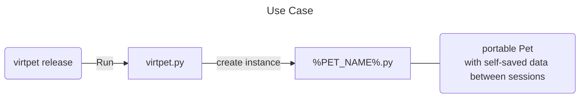

# virtpet
## About
Portable virtual pets
## Usage

1. Install dependencies
`*script to install dependencies*`
2. Run `virtpet.py`
3. Run created `%pet_name%.py`
## Supported OS
**Windows, Linux & MacOS**
