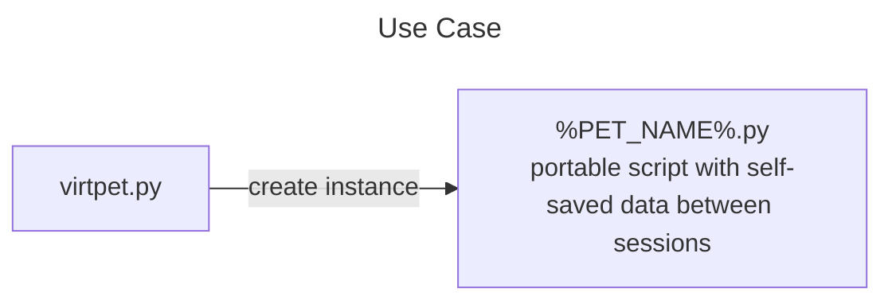
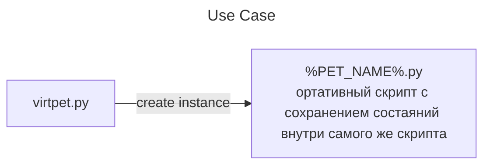

# virtpet
## About
Portable virtual pets
### Features
-
## Usage

1. Run `virtpet.py`
2. Choose your pet and give it a name.
3. Run created `%pet_name%.py`
## Dependencies
- [keyboard](https://pypi.org/project/keyboard)
- ~~[consoledraw](https://github.com/Matthias1590/ConsoleDraw)~~
- ~~[inquirer](https://pypi.org/project/inquirer)~~
- ~~[easy-ansi](https://pypi.org/project/easy-ansi)~~
## Supported OS
**Windows, Linux & MacOS**

# virtpet (RU)
## Об игре
Виртуальные питомцы на вашем компьтере 
### (планируемые) Особенности
-
## Usage

1. Запустить `virtpet.py`
2. Выбрать питомца и его имя.
3. Запустить созданный `%pet_name%.py`
## Зависимости
- [keyboard](https://pypi.org/project/keyboard)
- ~~[consoledraw](https://github.com/Matthias1590/ConsoleDraw)~~
- ~~[inquirer](https://pypi.org/project/inquirer)~~
- ~~[easy-ansi](https://pypi.org/project/easy-ansi)~~
## Поддерживаемые ОС
**Windows, Linux & MacOS**
